# Software Architecture Diagrams

## System Diagrams

This section contains visual representations of the Schnapsen architecture:

- [Core Class Architecture](#core-class-architecture-diagram)
- [Game and Hand State Chart](#game-and-hand-state-chart)
- [Layered Architecture](#layered-architecture-diagram)
- [Deployment Architecture](#deployment-architecture)
- [Human Turn Sequence](#human-turn-sequence-diagram)
- [AI Turn Sequence](#ai-turn-sequence-diagram)
- [Talon Visual State Sequence](#talon-visual-state-sequence)
- [Game Flow Chart](#game-flow-chart)
- [Trick Resolution Flow Chart](#trick-resolution-flow-chart)
- [Atout Swap Flow Chart](#atout-swap-flow-chart)
- [Marriage Announcement Flow Chart](#marriage-announcement-flow-chart)
- [Player Seat Presentation Flow Chart](#player-seat-presentation-flow-chart)
- [Talon Visual State Flow Chart](#talon-visual-state-flow-chart)

---

### Core Class Architecture Diagram

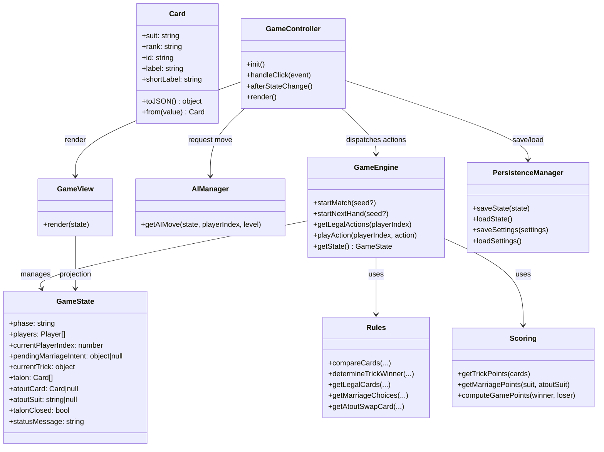

---

### Game and Hand State Chart

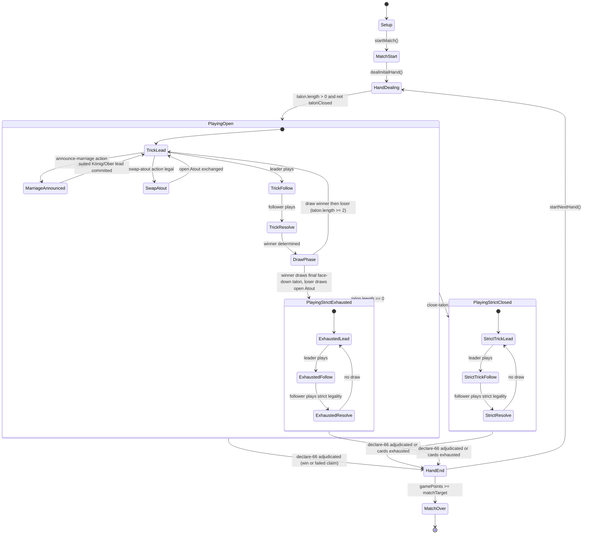

---

### Layered Architecture Diagram

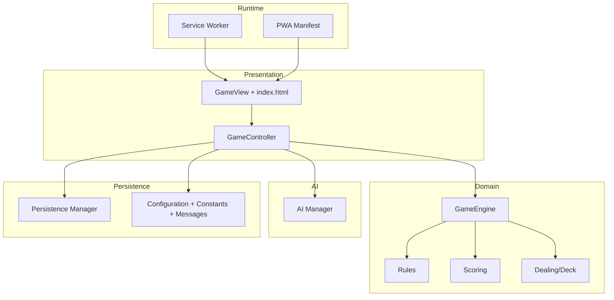

---

### Deployment Architecture

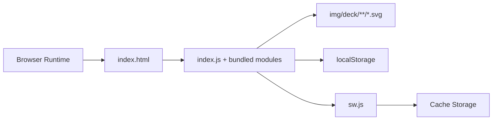

---

### Human Turn Sequence Diagram

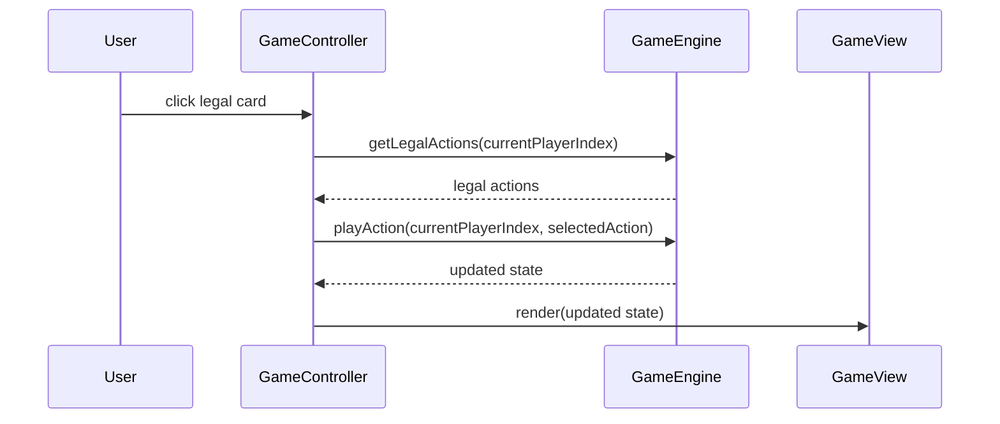

---

### AI Turn Sequence Diagram

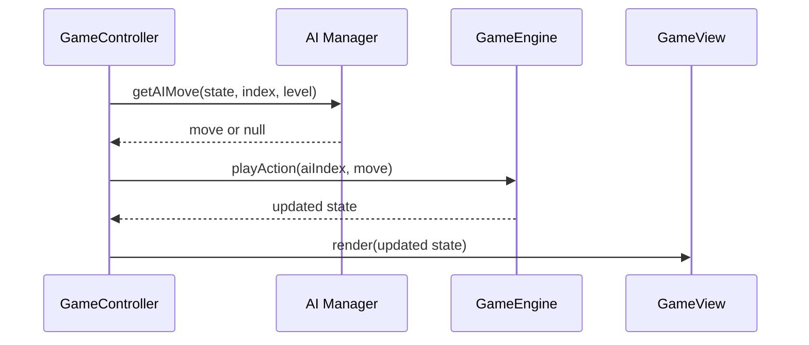

---

### Talon Visual State Sequence

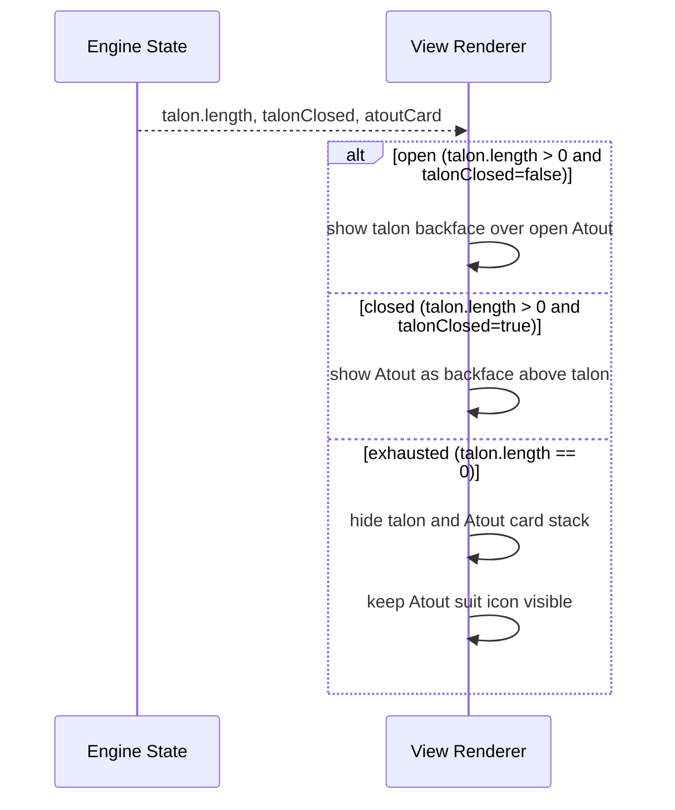

---

### Game Flow Chart

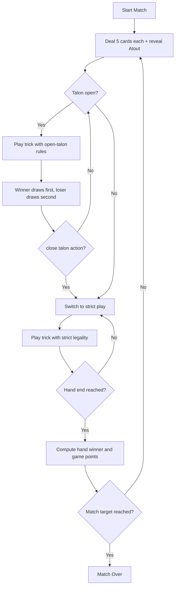

---

### Trick Resolution Flow Chart

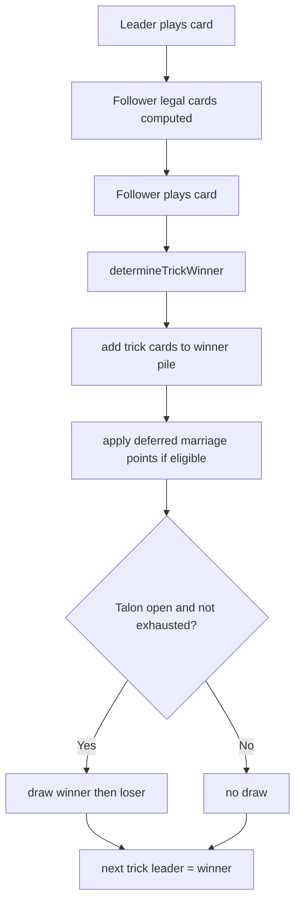

---

### Atout Swap Flow Chart

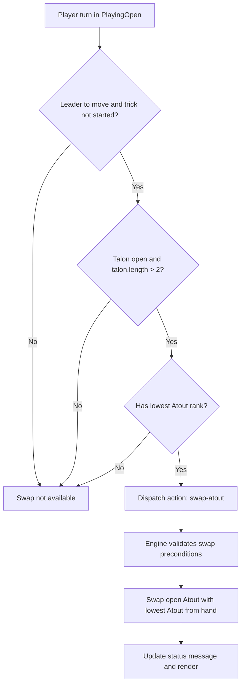

---

### Marriage Announcement Flow Chart

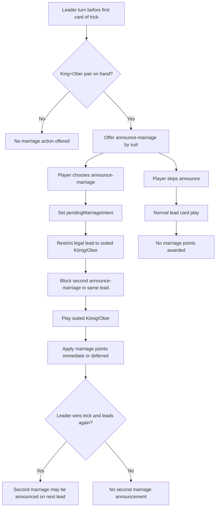

---

### Pre-Lead Edge-Case Workflow Flow Chart

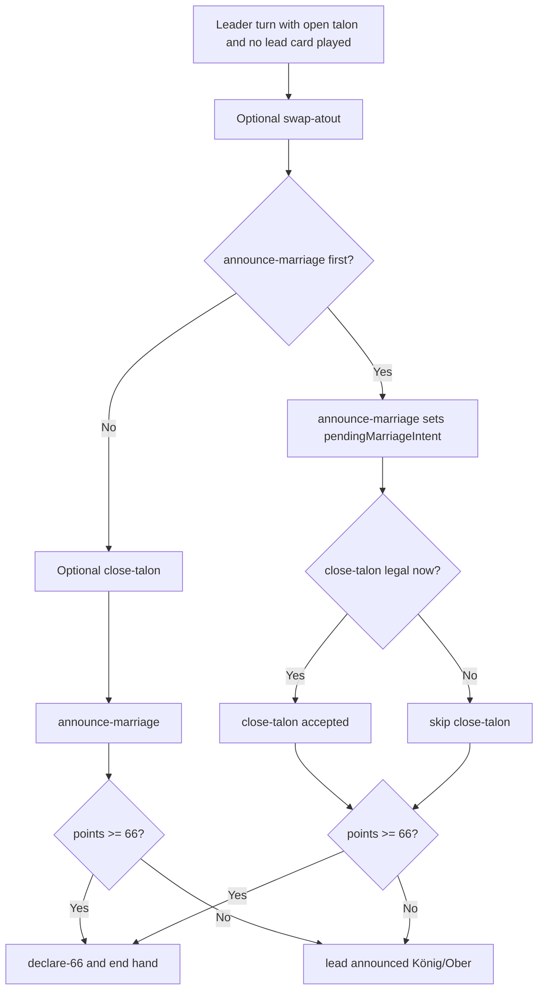

---

### Player Seat Presentation Flow Chart

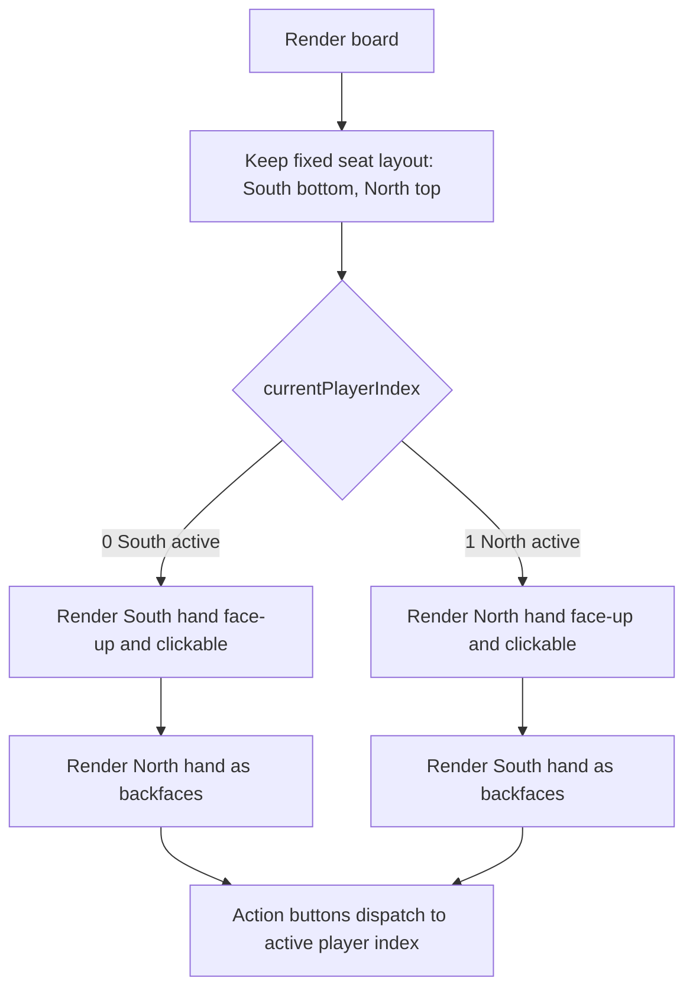

---

### Talon Visual State Flow Chart

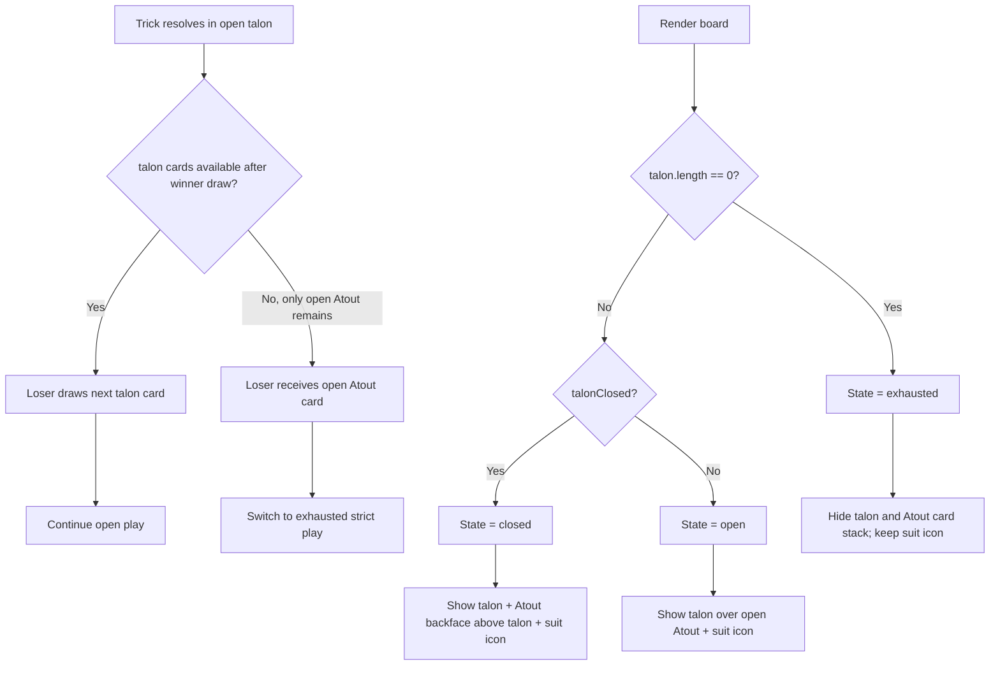
