# Software Architecture Runtime

## Data Flow

### Game Initialization

```mermaid
flowchart TD
    A[index.html] --> B[index.js bootstrap]
    B --> C[create GameEngine + GameView + PersistenceManager]
    C --> D[GameController.init()]
    D --> E[load settings and resumable state if present]
    E --> F[render board + shell + overlays]
```

### Talon/Atout Visual Runtime Flow

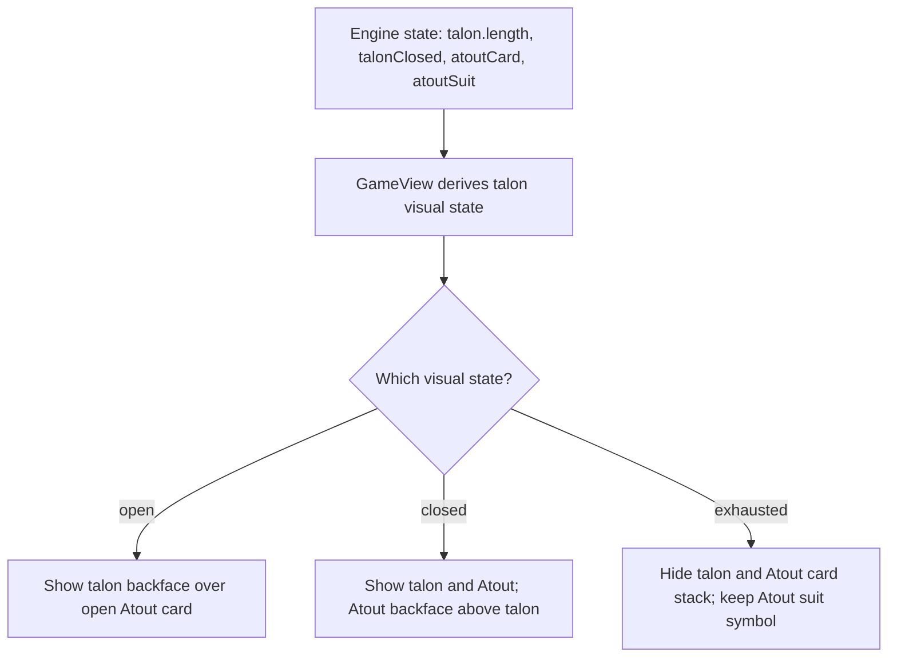

This visual logic is state-derived; no duplicated UI-only status flag is
required.

### Open Talon Draw Exhaustion Runtime Flow

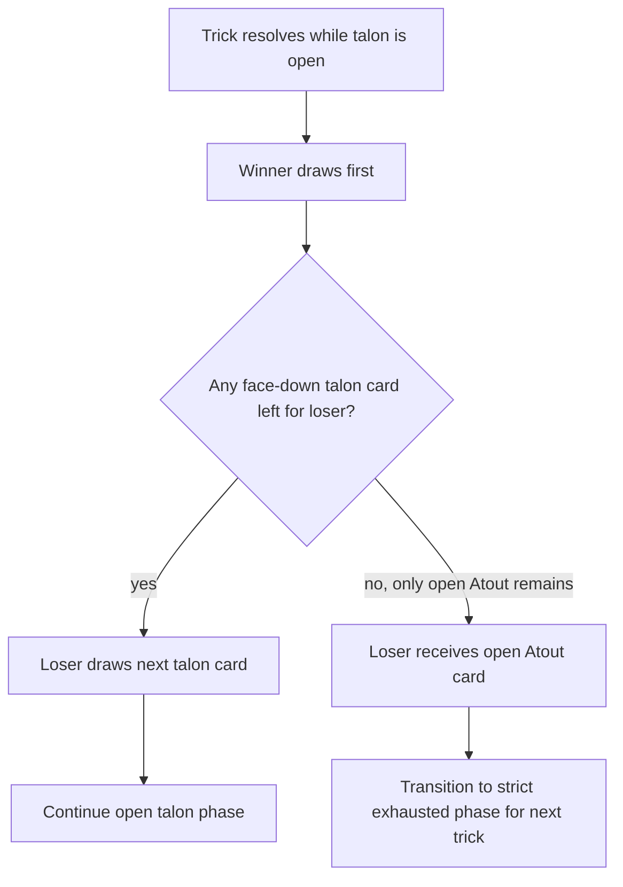

### Shell and Overlay Runtime Flow

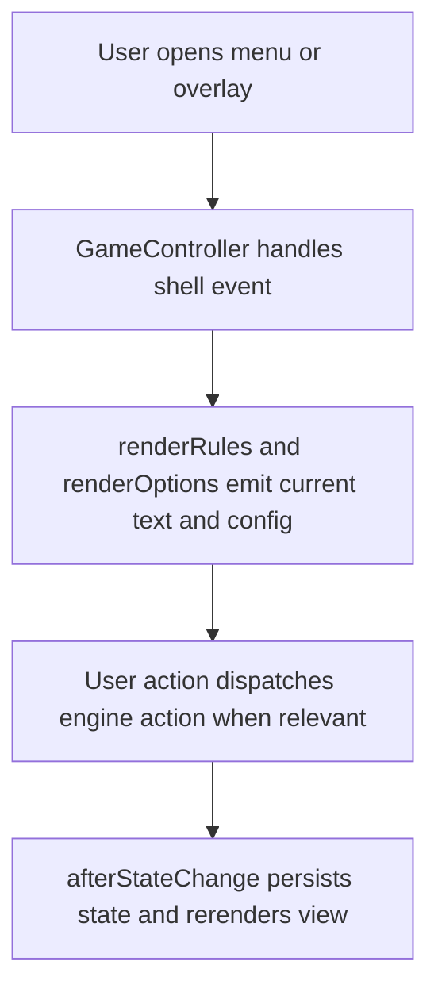

### Human Turn Execution

```mermaid
flowchart TD
    A[Player clicks playable hand card] --> B[GameController resolves legal action from engine]
    B --> C[GameEngine.playAction(player, action)]
    C --> D[Rules and scoring modules process trick and transitions]
    D --> E[GameView.render(newState)]
```

### Atout Swap Runtime Flow

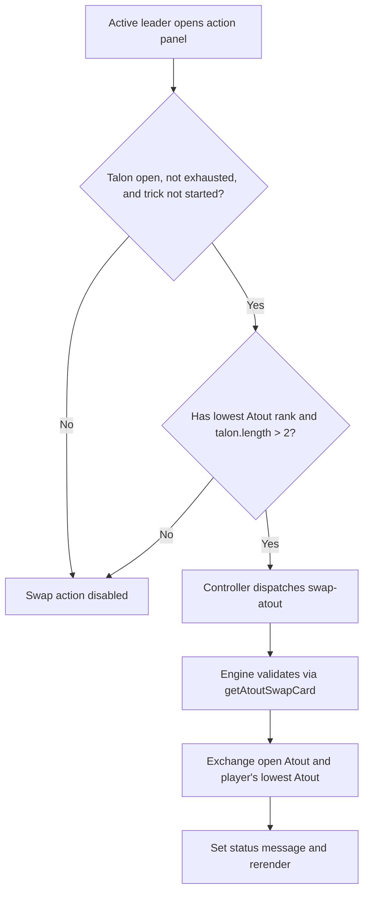

### Marriage Announcement Runtime Flow

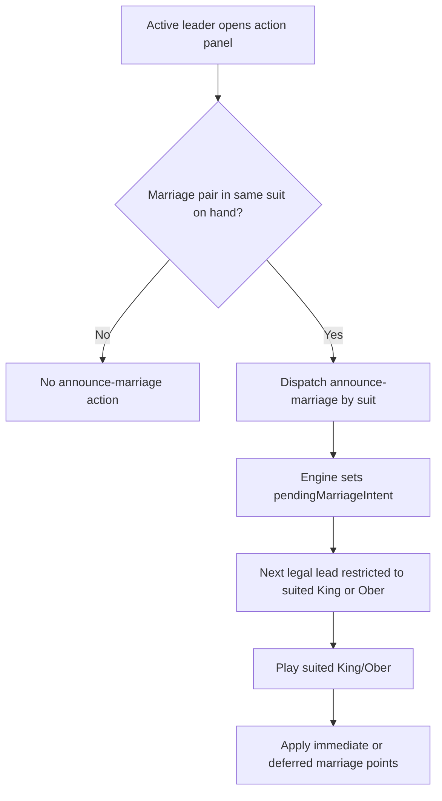

### Player Seat and Active Hand Presentation Flow

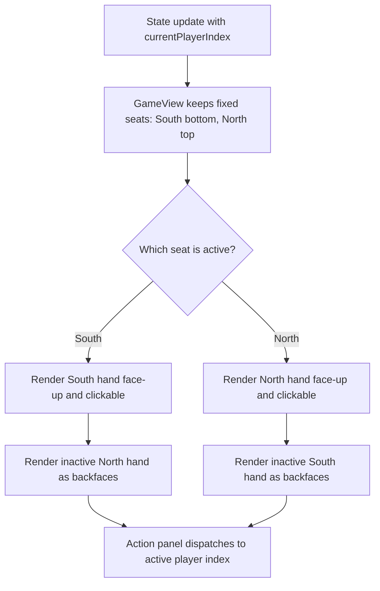

### AI Turn Execution

```mermaid
flowchart TD
    A[afterStateChange invokes maybeRunAI] --> B{Current player is AI and phase is playing?}
    B -->|Yes| C[getAIMove(state, playerIndex, aiLevel)]
    C --> D[GameEngine.playAction(aiPlayer, move)]
    D --> E[persist and rerender]
    B -->|No| F[No AI action]
```

### Hand Resolution and Match Progression

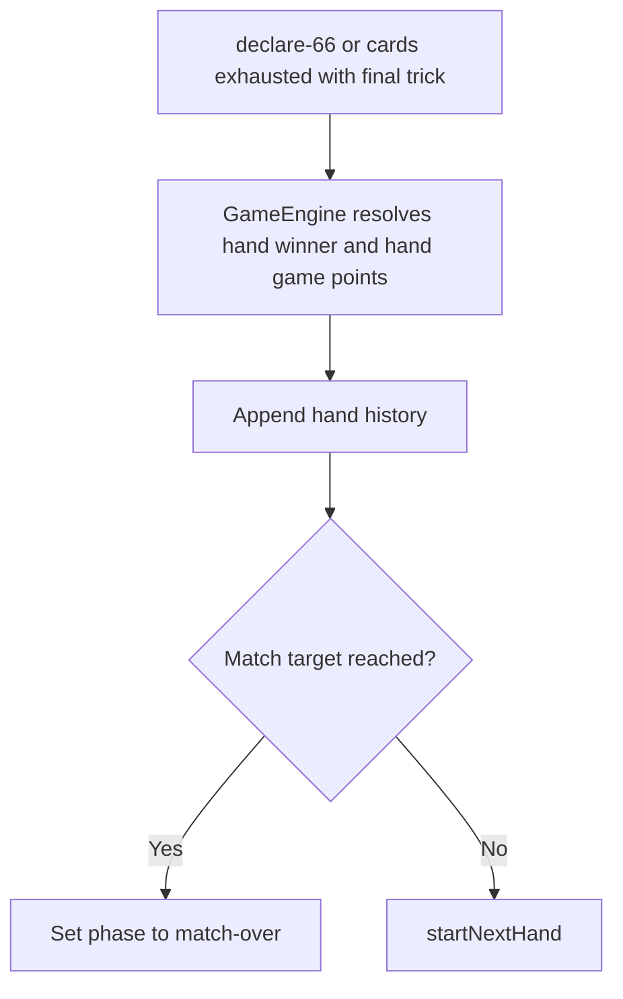

### Persistence and Resume Flow

```mermaid
flowchart TD
    A[User action or state change] --> B[PersistenceManager.saveState(state)]
    B --> C[App relaunch]
    C --> D[PersistenceManager.loadState()]
    D --> E[GameEngine.resume(savedState)]
```

---

## Component Interactions

### Object Message Exchange (UI to Engine)

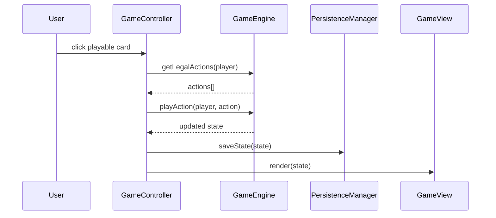

### Atout Swap Message Exchange

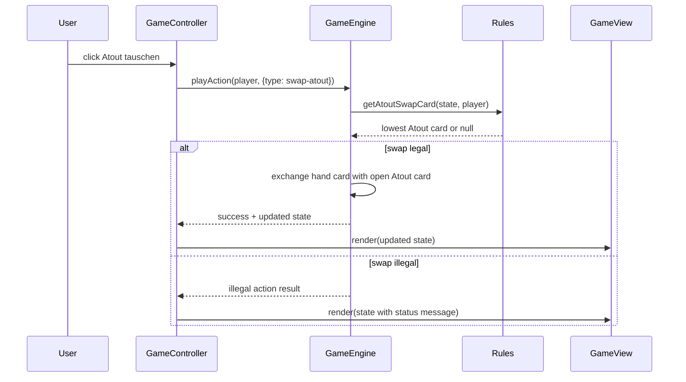

### Active Player Dispatch Exchange

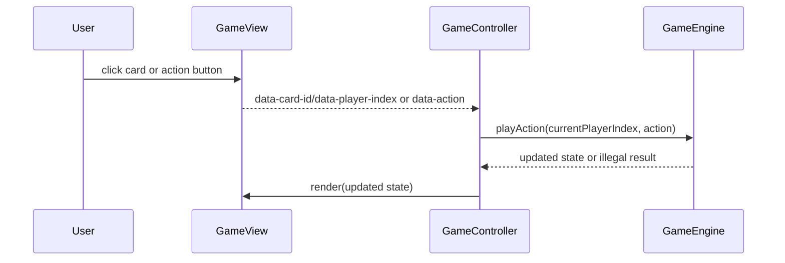

### AI Message Exchange

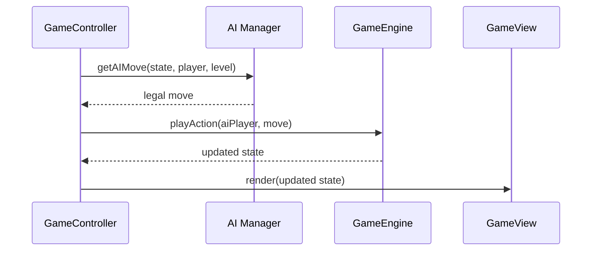

### Talon State Rendering Exchange

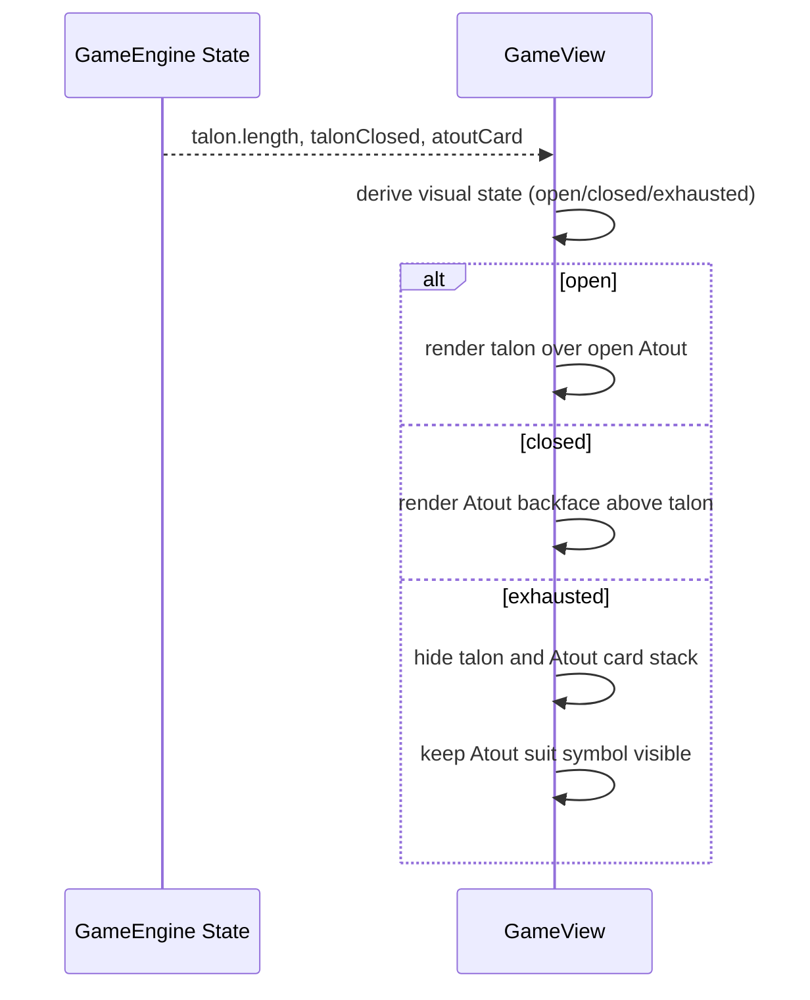

---

## Runtime Rules and Transition Semantics

- Open talon allows unconstrained follower play.
- Last open talon draw distributes in order: winner draws final face-down talon card, loser draws open Atout card.
- Open talon additionally allows Atout swap for the active leader only when the
    lowest Atout rank is held (24-card: 9, 20-card: Unter), no trick card has
    been played yet, and more than two talon cards remain.
- After talon exhaustion, strict play starts from the immediately following trick while Atout suit remains active to hand end.
- Marriage requires explicit announce-marriage action; without announcement,
    leading King/Ober yields no marriage points.
- After marriage announcement, legal lead is constrained to King/Ober of the
    announced suit for that trick.
- At most one marriage announcement is legal per lead/trick; if multiple
    marriageable suits are held, additional marriage announcements require later
    leads after trick resolution.
- While marriage intent is pending and no lead card is played yet, close-talon
    remains legal for the active leader if talon-close preconditions are met.
- Closed or exhausted talon activates strict legality.
- Closed talon explicitly disallows Atout swap.
- Marriage points apply immediately only if announcer already won at least one trick.
- Otherwise marriage points are deferred and converted when announcer wins first trick.
- Declare-66 is legal only for active leader before a trick card is played.
- Wrong declare-66 resolves immediately as hand loss for declarer with fixed
    2/3 penalty (3 only if declarer won no trick).
- If nobody claims 66 before cards are exhausted, the final trick winner takes
    the hand for exactly 1 game point.
- Closed-talon failure uses the same fixed 2/3 penalty principle when closer
    does not correctly declare 66 before remaining cards run out.
- Atout/talon UI state is a projection of engine state, not an independent
  finite state in controller code.
- Seat layout remains fixed South/North; active/inactive visibility changes are
    projection-only and do not mutate seat order.

### Edge-Case Ordered Pre-Lead Workflow

The pre-lead action window is intentionally reorderable when legality permits.
Two important ordered workflows are supported as edge-case sample paths, but
only when every individual step is legal at execution time:

- `swap-atout -> close-talon -> announce-marriage -> declare-66`
- `swap-atout -> announce-marriage -> close-talon -> (declare-66 or lead announced King/Ober)`

In the second workflow, closing talon after marriage announcement must not clear
pending marriage intent, and the post-close legal set is still constrained by
the announced marriage unless declare-66 legally ends the hand first.

---

## Runtime Failure Handling

- Illegal action attempts are rejected by engine and reflected via status
  message.
- Persistence load failure falls back to fresh match start.
- AI move lookup returns null if state/player preconditions are not satisfied.
